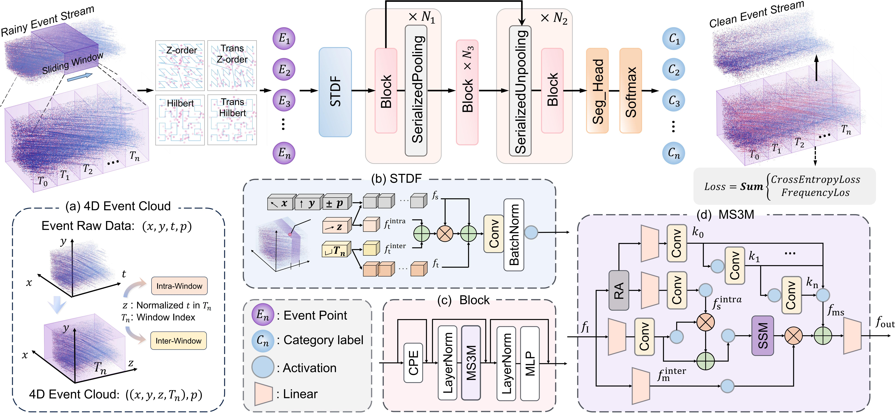
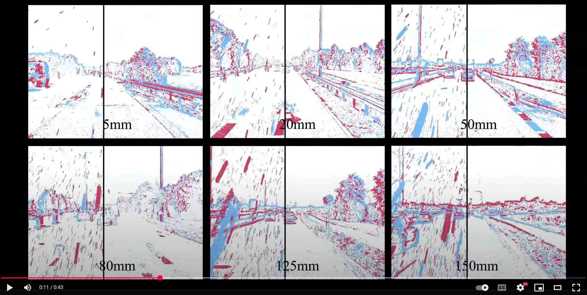

<p align="center">
<h1 align="center" style="display: flex; align-items: center; justify-content: center;">
  
  <span>PRE-Mamba: A 4D State Space Model for Ultra-High-Frequent Event Camera Deraining</span>
</h1>
<h3 align="center">ICCV 2025</h3>

<div align="center">
  <!-- Paper badge -->
  <a href="https://arxiv.org/abs/2505.05307">
    
  </a>
  <!-- Dataset badge -->
  <a href="https://huggingface.co/datasets/Rshnn/EventRain-27K/blob/main/README.md">
    
  </a>
  <!-- License badge -->
  <a href="https://opensource.org/licenses/MIT">
  
  </a>

</div>

<p align="center">

</p>
<b><p align="center" style="margin-top: -20px;">
PRE-Mamba

## Demo video

<p align="center">
  <a href="https://www.youtube.com/watch?v=gwno_lHGzQU" target="_blank">
    
  </a>
</p>

</b></p>

## Overview
- [x] [Environment](#environment) 
- [x] [Dataset preparation](#dataset-preparation)
- [x] [Run](#run)
- [ ] [Citation](#citation)
- [x] [Acknowledgement](#acknowledgement)

## Environment
```
# pointcept with CUDA=11.6
conda create -n pointcept python=3.8 -y
conda activate pointcept
conda install ninja -y
conda install pytorch==1.12.1 torchvision==0.13.1 torchaudio==0.12.1 cudatoolkit=11.6 -c pytorch -c conda-forge
conda install h5py pyyaml -c anaconda -y
conda install sharedarray tensorboard tensorboardx yapf addict einops scipy plyfile termcolor timm -c conda-forge -y
conda install pytorch-cluster pytorch-scatter pytorch-sparse -c pyg -y

pip install torch-geometric
pip install spconv-cu116
pip install open3d

cd libs/pointops
python setup.py install
cd ../../

# mamba install
cd libs/
git clone https://github.com/Dao-AILab/causal-conv1d.git
cd causal-conv1d
git checkout v1.1.3 
CAUSAL_CONV1D_FORCE_BUILD=TRUE pip install .
cd ..
git clone https://github.com/state-spaces/mamba.git
cd mamba
git checkout v1.1.4 
MAMBA_FORCE_BUILD=TRUE pip install .
```

## Dataset preparation
Our dataset [EventRain-27K](https://huggingface.co/datasets/Rshnn/EventRain-27K) is now available on Hugging Face.

## Run
### Training
```bash
export CUDA_VISIBLE_DEVICES=${CUDA_VISIBLE_DEVICES}
bash scripts/train.sh -g ${NUM_GPU} -d ${DATASET_NAME} -c ${CONFIG_NAME} -n ${EXP_NAME}
```
For example:
```bash
export CUDA_VISIBLE_DEVICES=0,1,2,3,4,5
bash scripts/train.sh -g 6 -d event_rain -c PRE_Mamba -n SYTHETIC
```

### Testing
<!-- In the testing phase, we used the same testing strategy as [pointcept](https://github.com/Pointcept/Pointcept), please read [its readme](https://github.com/Pointcept/Pointcept?tab=readme-ov-file#testing) for information. -->
```bash
bash scripts/test.sh -g ${NUM_GPU} -d ${DATASET_NAME} -c ${CONFIG_NAME} -n ${EXP_NAME} -w ${CHECKPOINT_NAME}
```
For example:
```bash
export CUDA_VISIBLE_DEVICES=0
# weight path: ./exp/event_rain/SYTHETIC/model/model_best.pth
bash scripts/test.sh -g 1 -d event_rain -c PRE_Mamba -n SYTHETIC -w model_best
```

<!-- ## Citation

If you find this repository helpful to your research, please consider citing the following:

```

``` -->

## Acknowledgement
The code framework of this project is based on  [pointcept](https://github.com/Pointcept/Pointcept) and [MambaMOS](https://github.com/Terminal-K/MambaMOS/tree/main), thanks to their excellent work.
